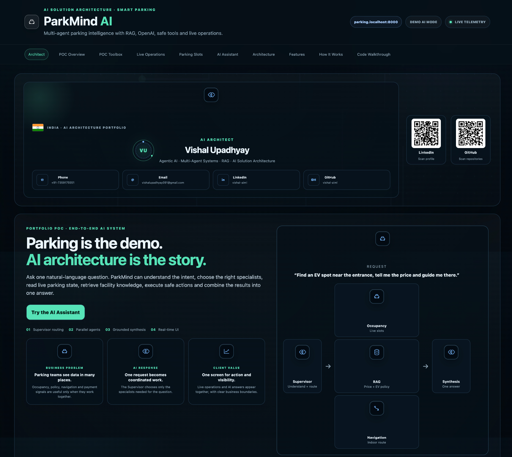
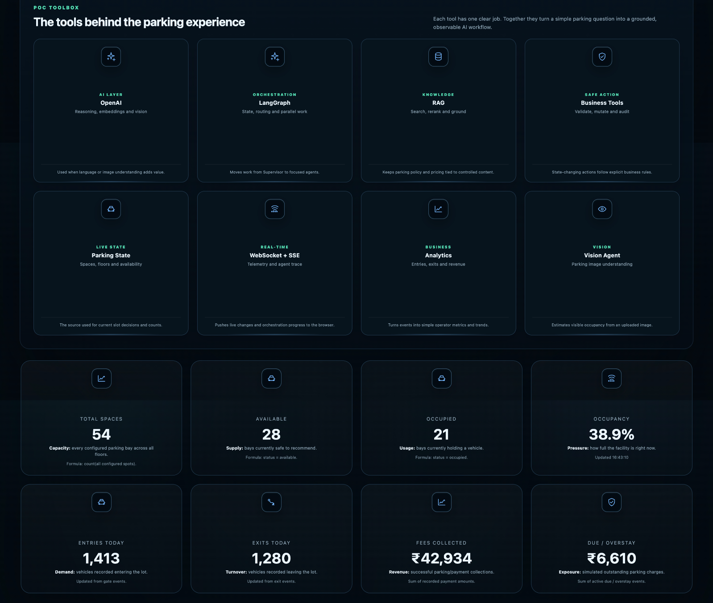
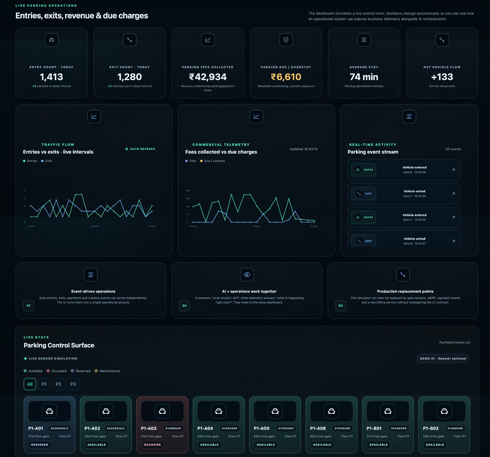
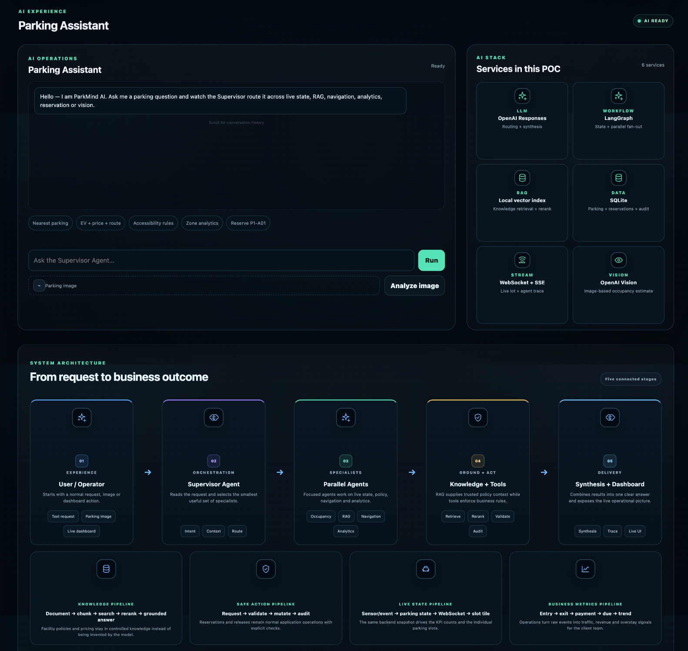

# ParkMind AI

**Real-Time Smart Parking Operations with Agentic AI, RAG and Live Telemetry**

ParkMind AI is a portfolio-ready proof of concept that shows how an AI assistant can work with live parking data, facility knowledge, specialist agents and business tools in one practical workflow.

It is designed to answer a simple business question:

> **How can a parking system use AI to understand a driver's request, find the right information, make a safe recommendation and show what is happening in the parking lot right now?**

The project is intentionally easy to run locally. It does **not** require Docker, PostgreSQL, Redis or Qdrant for the demo.

---

## Demo Video

[](https://youtu.be/5qbt1aVouQU)

▶️ **Watch the full walkthrough on YouTube:** [ParkMind AI – Agentic AI Smart Parking POC](https://youtu.be/5qbt1aVouQU)

---

## Project Owner

**Vishal Upadhyay**  
**AI Architect**  
Phone: +91-7359175551  
Email: vishalupadhyay091@gmail.com  
LinkedIn: https://www.linkedin.com/in/vishal-aiml/  
GitHub: https://github.com/vishal-aiml

---

## Screenshots

### 1. Architect profile and POC overview

One natural-language question becomes coordinated work: Supervisor routing, parallel agents, grounded synthesis and a real-time UI.


### 2. POC toolbox and live KPIs

Each tool has one clear job: OpenAI, LangGraph, RAG, business tools, parking state, WebSocket + SSE, analytics and vision. Live KPIs show total, available and occupied spaces, occupancy %, entries, exits, fees collected and due/overstay charges.



### 3. Live operations and parking control surface

Entries vs exits, fees vs due charges, a real-time event stream and slot tiles (Available, Occupied, Reserved, Maintenance) driven by the same operational state as the KPIs.



### 4. AI assistant and system architecture

Ask the Supervisor Agent a question, watch it route across specialists, and see the five connected stages from request to business outcome.



<details>
<summary><b>View the full-page dashboard</b></summary>


</details>

---

## What this POC demonstrates

ParkMind AI combines two kinds of work:

1. **AI request handling** — understand the request, choose the right specialists, retrieve knowledge and prepare a clear answer.
2. **Parking operations** — track slots, entries, exits, payments, due charges and live activity.

This separation is important because the language model should not invent operational facts or directly change parking state.

### Core rule

**AI recommends. Business tools validate. The data layer remains the source of truth.**

---

## Client-facing UI flow

The dashboard is built as a single-page product story:

```text
Architect Profile
      ↓
POC Overview
      ↓
POC Toolbox
      ↓
Live Operations Dashboard
      ↓
Parking Slots
      ↓
AI Assistant + Control View
      ↓
System Architecture
      ↓
Features
      ↓
How It Works
      ↓
Code + Observability
```

The UI includes live counters, parking-slot state changes, charts, an event stream, an AI chat panel, architecture cards and detailed modal explanations.

---

## Main architecture

```text
                         PARKMIND AI
                              │
                    ┌─────────┴─────────┐
                    │  Driver / Operator│
                    │       Web UI      │
                    └─────────┬─────────┘
                              │
                              ▼
                         FastAPI API
                              │
                              ▼
                       Supervisor Agent
                              │
                        LangGraph Flow
                              │
          ┌───────────────────┼────────────────────┐
          │                   │                    │
          ▼                   ▼                    ▼
     Occupancy           Knowledge/RAG        Navigation
          │                   │                    │
          │                   ├─ retrieval         │
          │                   ├─ reranking         │
          │                   └─ facility rules    │
          │                                        │
          ├────────── Reservation                  │
          ├────────── Analytics                    │
          └────────── Vision                       │
                              │
                              ▼
                       Synthesis Agent
                              │
                              ▼
                        Final Answer

Live operations path:

Parking Simulator / Events
          │
          ├── Entry / Exit
          ├── Occupancy
          ├── Payment
          ├── EV Session
          ├── Reservation
          └── Overstay / Due
                    │
                    ▼
             Operations State
                    │
          ┌─────────┴─────────┐
          ▼                   ▼
      Dashboard            WebSocket
```

---

## Agents and responsibilities

| Component | Responsibility |
|---|---|
| Supervisor Agent | Understand the request and decide which specialists are needed. |
| Occupancy Agent | Find currently available, occupied, reserved and maintenance slots. |
| Reservation Agent | Validate and execute reservation/release operations through deterministic business logic. |
| Navigation Agent | Produce a simple route from the entrance to a selected slot or zone. |
| Knowledge Agent | Retrieve parking rules, EV information, pricing and facility documents using RAG. |
| Analytics Agent | Explain occupancy, traffic, fees and due-charge metrics. |
| Vision Agent | Analyse an uploaded parking image and estimate visible occupancy. |
| Synthesis Agent | Combine specialist results into one clear response for the user. |

---

## POC toolbox

### OpenAI
Used for model reasoning, synthesis, embeddings and image analysis when an API key is configured.

### LangGraph
Used to represent the agent workflow and fan out work to multiple specialists.

### RAG
Used for facility-specific information such as pricing rules, EV charging policy, accessibility and safety.

### Local vector search
Keeps the demo self-contained and easy to run without a separate vector database.

### SQLite
Stores parking state, reservations, events and audit information locally.

### WebSocket + SSE
WebSocket carries live parking/operations updates. SSE provides a lightweight agent execution trace.

### Deterministic business tools
Reservation and other state-changing actions are validated in application code rather than trusted directly to the LLM.

### Vision
Parking images can be analysed through the Vision Agent when full AI mode is enabled.

---

## Example: one request, several specialists

A driver asks:

> **Find an EV charging spot near the entrance and tell me the price and route.**

The system can handle this as:

```text
User request
    ↓
Supervisor
    ↓
┌──────────────┬────────────────┬──────────────┐
│ Occupancy    │ Knowledge / RAG│ Navigation   │
│ live slots   │ EV + pricing   │ route        │
└──────┬───────┴────────┬───────┴──────┬───────┘
       └─────────────────┼─────────────┘
                         ▼
                     Synthesis
                         ▼
                  Simple driver answer
```

### What each agent contributes

- **Occupancy**: Which suitable EV slots are currently available?
- **Knowledge/RAG**: What are the EV rules and current facility pricing rules?
- **Navigation**: How does the driver reach the selected slot from the entrance?
- **Synthesis**: Combine the results and explain them in simple English.

---

## RAG flow

The knowledge base is stored in `knowledge/` as small Markdown documents.

```text
Knowledge documents
       ↓
Chunking
       ↓
Embedding
       ↓
Local vector index
       ↓
Semantic retrieval
       ↓
Reranking
       ↓
Grounded context
       ↓
Agent response
```

When the OpenAI key is available, embeddings are generated with the configured OpenAI embedding model.

Without the key, the POC can still run in Demo AI Mode using its local fallback flow.

---

## Live operations dashboard

The demo includes a local simulator so the dashboard remains interesting even without real parking hardware.

The simulator continuously changes parking and operational state.

### Live KPIs

- Total spaces
- Available spaces
- Occupied spaces
- Reserved spaces
- Occupancy percentage
- Entries today
- Exits today
- Net vehicle flow
- Parking fees collected
- Parking due / overstay charges
- Average stay

### Live charts

- Entries vs exits over time
- Fees collected vs due charges over time

### Activity stream

Example events include:

```text
ENTRY        Vehicle entered at Gate A
EXIT         Vehicle exited at Gate C
PAYMENT      Parking fee collected
EV           Charging session started
RESERVATION  Parking slot reserved
OVERSTAY     Parking due charge created
```

The parking-slot tiles use the same operational state as the KPI layer, so a simulator update can change both the summary numbers and the exact slot tile.

---

## Demo AI mode

An OpenAI key is **optional**.

### Full AI mode

Set:

```env
OPENAI_API_KEY=your_key_here
OPENAI_MODEL=gpt-5
OPENAI_EMBEDDING_MODEL=text-embedding-3-small
```

### Demo AI mode

Leave the key empty:

```env
OPENAI_API_KEY=
```

The application still starts and shows polished parking answers using the built-in demo response path.

This is useful when showing the POC to a client or interviewer without exposing an API key.

---

## Local setup

### 1. Create a virtual environment

macOS / Linux:

```bash
python3 -m venv venv
source venv/bin/activate
```

### 2. Install dependencies

```bash
python -m pip install --upgrade pip
pip install -r requirements.txt
```

### 3. Configure environment

```bash
cp .env.example .env
```

Add your OpenAI key if you want full AI mode.

### 4. Start the application

```bash
python run.py
```

### 5. Open the dashboard

Local friendly URL:

```text
http://parking.localhost:8000/parking/
```

API documentation:

```text
http://localhost:8000/docs
```

Health check:

```text
http://localhost:8000/health
```

---

## Useful demo prompts

```text
Find me the nearest available parking.

Find an EV charging spot near the entrance and tell me the price and route.

What are the accessibility parking rules?

Show occupancy analytics by zone.

Show today's parking revenue and overstay charges.

Reserve P1-A01 for 2 hours.

Release P1-A01 for user demo-user.

Explain how the reservation flow works.
```

---

## Vision demo

Use the **Vision** area in the dashboard to upload a parking image.

The Vision Agent can use the image to estimate visible occupancy when full AI mode is enabled.

A production solution could later connect this flow to CCTV, edge computer vision or an existing parking-camera service.

---

## Why this architecture matters

A parking application looks simple until it has to combine:

- live occupancy,
- user requests,
- facility rules,
- reservations,
- navigation,
- payments,
- EV charging,
- analytics,
- image understanding,
- and real-time monitoring.

A single prompt is not a good boundary for all of those responsibilities.

ParkMind uses a more structured approach:

```text
Supervisor
   ↓
Specialists
   ↓
Knowledge + Data + Tools
   ↓
Validated result
   ↓
Synthesis
   ↓
User experience
```

The model is useful for understanding and reasoning, while deterministic services protect the business state.

---

## Production evolution

The POC deliberately uses local components so it is easy to run and explain.

A production version could evolve to:

| POC | Production direction |
|---|---|
| SQLite | Managed PostgreSQL or another production relational database |
| Local vector index | Managed vector database |
| In-process cache | Redis or managed cache |
| Local simulator | Parking gates, sensors, IoT and camera events |
| Demo navigation | Real indoor routing service/graph |
| Local authentication | SSO + RBAC |
| Basic audit | Centralized observability and audit platform |
| Single app process | Horizontally scalable API + worker architecture |

---

## Project structure

```text
parkmind-ai-poc/
├── app/
│   ├── agents/
│   │   ├── analytics.py
│   │   ├── base.py
│   │   ├── knowledge.py
│   │   ├── navigation.py
│   │   ├── occupancy.py
│   │   ├── reservation.py
│   │   ├── supervisor.py
│   │   └── vision.py
│   ├── static/
│   │   ├── assets/
│   │   ├── app.js
│   │   ├── index.html
│   │   └── styles.css
│   ├── api.py
│   ├── cache.py
│   ├── config.py
│   ├── events.py
│   ├── graph.py
│   ├── main.py
│   ├── models.py
│   ├── openai_service.py
│   ├── operations.py
│   ├── rag.py
│   └── repository.py
├── docs/
│   └── images/
│       ├── 00-full-page-preview.jpg
│       ├── 01-architect-overview.png
│       ├── 02-poc-toolbox-kpis.png
│       ├── 03-live-operations-parking-slots.png
│       └── 04-ai-assistant-architecture.png
├── knowledge/
├── .env.example
├── .gitignore
├── README.md
├── requirements.txt
└── run.py
```

---

## Security notes

- Never commit `.env` or an API key.
- Use `.env.example` for documented configuration names.
- Keep secrets outside source code.
- Do not use a real production database with the demo configuration.
- Treat uploaded images as untrusted input in a production deployment.
- Add authentication, authorization, rate limiting and centralized audit controls before exposing the service publicly.

---

## Portfolio goal

ParkMind AI is meant to show **how an AI Solution Architect thinks beyond the model**.

The interesting part is the combination of:

**AI reasoning + agent orchestration + RAG + business tools + real-time operations + observability + user experience.**

Built by **Vishal Upadhyay — AI Architect**.

---

## Connect

- 🎥 Demo video: https://www.youtube.com/watch?v=5qbt1aVouQU
- 💼 LinkedIn: https://www.linkedin.com/in/vishal-aiml/
- 💻 GitHub: https://github.com/vishal-aiml
- ✉️ Email: vishalupadhyay091@gmail.com
